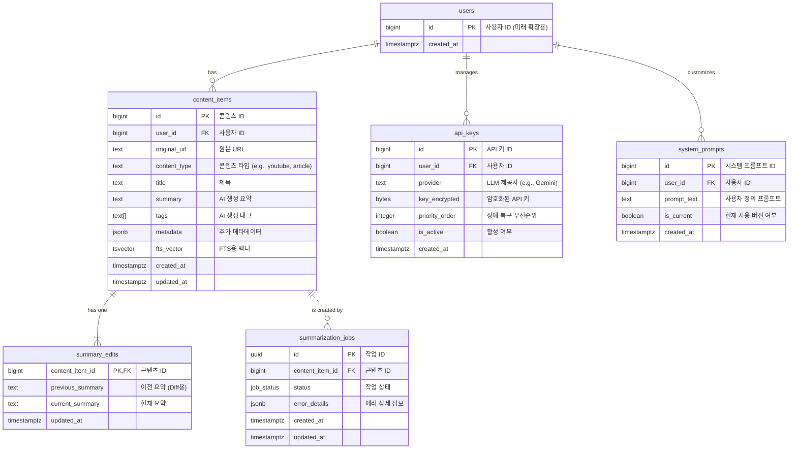

## AI 요약 서비스 ERD 상세 설계서

### 1\. ERD (Mermaid)



-----

### 2\. 엔티티 정의

  - **`content_items`**: 사용자가 추가한 각 URL(웹 아티클, YouTube 영상 등)의 원본 정보와 AI가 생성한 요약, 태그 등을 저장하는 핵심 테이블입니다.
  - **`summary_edits`**: 사용자가 AI 요약을 수정한 경우, 이전 버전과 현재 버전을 비교(Diff)하여 보여주기 위한 데이터를 저장합니다. 전체 이력을 저장하지 않고 최종 수정본과 그 직전 버전만 관리합니다.
  - **`summarization_jobs`**: URL로부터 요약을 생성하는 비동기 작업의 상태(대기, 처리 중, 완료, 실패)를 추적합니다. 이를 통해 사용자에게 작업 진행 상황을 피드백하고, 실패 시 원인을 파악할 수 있습니다.
  - **`api_keys`**: 여러 LLM API 키를 저장하고, 우선순위에 따른 장애 복구(Fail-over) 로직을 위해 관리합니다. 키는 `pgcrypto`를 통해 암호화되어 저장됩니다.
  - **`system_prompts`**: AI 요약 생성 시 사용될 기본 프롬프트를 사용자가 직접 수정하고 관리할 수 있도록 합니다.
  - **`users`**: 현재는 단일 사용자(ID=1)를 가정하지만, 향후 다중 사용자 환경으로 확장을 용이하게 하기 위한 가상 테이블입니다.

-----

### 3\. 속성 명세

#### `content_items`

| 컬럼명 | 데이터 타입 | PK/FK | 제약 조건 | 설명 |
| --- | --- | --- | --- | --- |
| `id` | `bigserial` | PK | | 콘텐츠의 고유 식별자 (Auto-increment) |
| `user_id` | `bigint` | FK | `NOT NULL`, `DEFAULT 1` | 소유자 ID (users.id 참조) |
| `original_url` | `text` | | `NOT NULL`, `UNIQUE` | 원본 콘텐츠의 URL |
| `content_type` | `text` | | `NOT NULL` | 콘텐츠 타입 (예: 'youtube', 'article') |
| `title` | `text` | | | 콘텐츠 제목 |
| `summary` | `text` | | | AI가 생성한 요약문 |
| `tags` | `text[]` | | | AI가 생성한 태그 배열 |
| `metadata` | `jsonb` | | | 추가 정보 (예: 영상 길이, 작성자) |
| `fts_vector` | `tsvector` | | | Full-Text Search를 위한 tsvector 컬럼 |
| `created_at` | `timestamptz` | | `NOT NULL`, `DEFAULT now()` | 생성 시각 |
| `updated_at` | `timestamptz` | | `NOT NULL`, `DEFAULT now()` | 마지막 수정 시각 |

#### `summary_edits`

| 컬럼명 | 데이터 타입 | PK/FK | 제약 조건 | 설명 |
| --- | --- | --- | --- | --- |
| `content_item_id` | `bigint` | PK, FK | `NOT NULL` | 원본 콘텐츠 ID (content\_items.id 참조) |
| `previous_summary` | `text` | | `NOT NULL` | 수정 전 요약문 |
| `current_summary` | `text` | | `NOT NULL` | 현재 (수정된) 요약문 |
| `updated_at` | `timestamptz` | | `NOT NULL`, `DEFAULT now()` | 수정 시각 |

#### `summarization_jobs`

| 컬럼명 | 데이터 타입 | PK/FK | 제약 조건 | 설명 |
| --- | --- | --- | --- | --- |
| `id` | `uuid` | PK | `DEFAULT gen_random_uuid()` | 작업의 고유 식별자 |
| `content_item_id` | `bigint` | FK | `NULL` | 생성될 콘텐츠 ID (작업 성공 후 업데이트) |
| `status` | `job_status` | | `NOT NULL`, `DEFAULT 'pending'` | 작업 상태 Enum ('pending', 'processing', 'completed', 'failed') |
| `error_details` | `jsonb` | | | 실패 시 에러 정보 저장 |
| `created_at` | `timestamptz` | | `NOT NULL`, `DEFAULT now()` | 생성 시각 |
| `updated_at` | `timestamptz` | | `NOT NULL`, `DEFAULT now()` | 마지막 상태 변경 시각 |

#### `api_keys`

| 컬럼명 | 데이터 타입 | PK/FK | 제약 조건 | 설명 |
| --- | --- | --- | --- | --- |
| `id` | `bigserial` | PK | | API 키의 고유 식별자 |
| `user_id` | `bigint` | FK | `NOT NULL`, `DEFAULT 1` | 소유자 ID (users.id 참조) |
| `provider` | `text` | | `NOT NULL` | LLM 제공자 (예: 'gemini', 'openai') |
| `key_encrypted` | `bytea` | | `NOT NULL` | pgcrypto로 암호화된 API 키 |
| `priority_order` | `integer` | | `NOT NULL`, `UNIQUE` | 장애 복구 시도 순서 (낮을수록 우선) |
| `is_active` | `boolean` | | `NOT NULL`, `DEFAULT true` | 키 활성화 여부 |
| `created_at` | `timestamptz` | | `NOT NULL`, `DEFAULT now()` | 생성 시각 |

#### `system_prompts`

| 컬럼명 | 데이터 타입 | PK/FK | 제약 조건 | 설명 |
| --- | --- | --- | --- | --- |
| `id` | `bigserial` | PK | | 프롬프트의 고유 식별자 |
| `user_id` | `bigint` | FK | `NOT NULL`, `DEFAULT 1` | 소유자 ID (users.id 참조) |
| `prompt_text` | `text` | | `NOT NULL` | 요약 생성을 위한 시스템 프롬프트 |
| `is_current` | `boolean` | | `NOT NULL`, `DEFAULT true` | 현재 사용 중인 프롬프트인지 여부 |
| `created_at` | `timestamptz` | | `NOT NULL`, `DEFAULT now()` | 생성 시각 |

-----

### 4\. 관계 매핑 및 키 구조

  - **`users` (1) : (N) `content_items`**
      - 한 명의 사용자는 여러 콘텐츠 아이템을 가질 수 있습니다.
      - FK: `content_items.user_id` -\> `users.id`
  - **`content_items` (1) : (1) `summary_edits`**
      - 하나의 콘텐츠 아이템은 최대 하나의 수정 이력(이전/현재)을 가집니다.
      - FK: `summary_edits.content_item_id` -\> `content_items.id`
      - Note: `summary_edits.content_item_id`는 PK이기도 하여 1:1 관계를 강제합니다.
  - **`content_items` (1) : (N) `summarization_jobs`**
      - 하나의 콘텐츠 아이템은 여러 번의 요약 재시도 작업(Job)을 가질 수 있습니다. (초기 설계는 1:1에 가깝지만, 재요약을 고려하여 1:N으로 설계)
      - FK: `summarization_jobs.content_item_id` -\> `content_items.id`
  - **`users` (1) : (N) `api_keys`**
      - 한 명의 사용자는 여러 API 키를 등록하고 관리할 수 있습니다.
      - FK: `api_keys.user_id` -\> `users.id`
  - **`users` (1) : (N) `system_prompts`**
      - 한 명의 사용자는 여러 버전의 시스템 프롬프트를 가질 수 있습니다. (`is_current`로 현재 버전 식별)
      - FK: `system_prompts.user_id` -\> `users.id`

-----

### 5\. 인덱스 전략

P95 30초 이내 요약 완료 및 200ms 이내 검색 응답 속도 목표를 달성하기 위해 다음 인덱스를 제안합니다.

  - **Full-Text Search (FTS) 최적화**:

      - **타겟 컬럼**: `content_items(title, summary, tags)`
      - **전략**: `GIN` 인덱스를 `content_items.fts_vector` 컬럼에 생성합니다.
      - **구현**:
        ```sql
        -- GIN 인덱스 생성
        CREATE INDEX idx_content_items_fts ON content_items USING gin(fts_vector);

        -- fts_vector 자동 업데이트를 위한 트리거 함수
        CREATE OR REPLACE FUNCTION update_fts_vector()
        RETURNS TRIGGER AS $$
        BEGIN
            NEW.fts_vector :=
                to_tsvector('korean', coalesce(NEW.title, '')) ||
                to_tsvector('korean', coalesce(NEW.summary, '')) ||
                to_tsvector('korean', array_to_string(NEW.tags, ' '));
            RETURN NEW;
        END;
        $$ LANGUAGE plpgsql;

        -- 트리거 적용
        CREATE TRIGGER tsvector_update
        BEFORE INSERT OR UPDATE ON content_items
        FOR EACH ROW EXECUTE FUNCTION update_fts_vector();
        ```
          - Note: `korean` 텍스트 검색 구성이 PostgreSQL에 설치되어 있어야 합니다. (예: `mecab-ko-dic-msvc-ko-dic-utf-8`)

  - **외래키 인덱스**:

      - JOIN 성능 향상을 위해 모든 외래키 컬럼에 B-Tree 인덱스를 생성합니다.
      - `CREATE INDEX idx_content_items_user_id ON content_items (user_id);`
      - `CREATE INDEX idx_summarization_jobs_content_item_id ON summarization_jobs (content_item_id);`
      - `CREATE INDEX idx_api_keys_user_id ON api_keys (user_id);`
      - `CREATE INDEX idx_system_prompts_user_id ON system_prompts (user_id);`

  - **조회 조건 최적화 인덱스**:

      - `api_keys` 테이블에서 활성화된 키를 우선순위 순으로 빠르게 조회하기 위한 인덱스.
          - `CREATE INDEX idx_api_keys_priority_order ON api_keys (priority_order) WHERE is_active = true;`
      - `summarization_jobs` 테이블에서 처리해야 할 작업을 빠르게 찾기 위한 인덱스.
          - `CREATE INDEX idx_summarization_jobs_status ON summarization_jobs (status) WHERE status = 'pending' OR status = 'processing';`
      - `content_items` 테이블에서 중복 URL 입력을 방지하기 위한 `UNIQUE` 인덱스.
          - `ALTER TABLE content_items ADD CONSTRAINT uq_original_url UNIQUE (original_url);`

-----

### 6\. 제약 조건 및 비즈니스 규칙

  - **사용자 ID**: 모든 주요 테이블(`content_items`, `api_keys`, `system_prompts`)의 `user_id`는 `DEFAULT 1`로 설정하여 현재 단일 사용자 환경을 지원하고, 향후 다중 사용자 확장 기반을 마련합니다.
  - **태그 저장**: `content_items.tags`는 `text[]` (텍스트 배열) 타입으로 저장하여 태그의 유연한 추가/삭제를 지원합니다.
  - **요약본 이력**: `summary_edits` 테이블은 `content_item_id`를 PK로 사용하여 콘텐츠당 단 하나의 행만 갖도록 강제함으로써, 마지막 버전과 이전 버전의 요약만 저장하는 규칙을 물리적으로 구현합니다.
  - **API 키 장애 복구**: 애플리케이션 로직에서 `is_active = true`인 키들을 `priority_order` 순으로 조회하여 LLM API 호출을 시도하고, 실패 시 다음 우선순위의 키를 사용합니다.
  - **작업 상태 관리**: `summarization_jobs.status`는 `ENUM` 타입(`job_status`)을 사용하여 `'pending'`, `'processing'`, `'completed'`, `'failed'` 외의 값이 들어오는 것을 방지하고 데이터 무결성을 보장합니다.

-----

### 7\. 데이터 타입 및 유효성 검사

  - **주요 데이터 타입**:
      - `bigserial`: 자동 증가하는 PK에 사용.
      - `timestamptz`: 타임존 정보를 포함하는 시각 정보에 사용.
      - `text`: 길이 제한이 없는 일반 텍스트에 사용.
      - `text[]`: 태그와 같이 여러 텍스트 값을 저장하는 데 사용.
      - `jsonb`: 구조화된 메타데이터나 에러 정보를 효율적으로 저장하고 쿼리하는 데 사용.
      - `uuid`: 전역적으로 고유해야 하는 작업 ID에 사용.
      - `bytea`: `pgcrypto` 확장 기능으로 암호화된 바이너리 데이터(API 키) 저장에 사용.
      - `job_status` (ENUM): `CREATE TYPE job_status AS ENUM ('pending', 'processing', 'completed', 'failed');` 와 같이 정의하여 사용.
  - **유효성 검사**:
      - `NOT NULL` 제약조건을 핵심 데이터(`original_url`, `user_id` 등)에 적용하여 데이터 누락을 방지합니다.
      - `content_items.original_url`에 `UNIQUE` 제약조건을 추가하여 동일한 URL이 중복 저장되는 것을 막습니다.
      - URL 형식, 이메일 형식 등의 유효성 검사는 데이터베이스 레벨(`CHECK` 제약조건)보다는 애플리케이션 레이어에서 처리하는 것을 권장합니다.

-----

### 8\. 정규화 분석

  - **3NF (제3정규형) 준수**:
      - 설계된 모든 테이블은 제3정규형을 만족합니다. 각 테이블의 모든 속성은 해당 테이블의 기본키에만 종속되며, 이행적 종속성(transitive dependency)이 제거되었습니다.
      - 예: `content_items`의 `title`, `summary` 등은 `content_item.id`에 직접적으로 의존합니다.
  - **제어된 비정규화 (Controlled Denormalization)**:
      - **`content_items.fts_vector`**: 검색 성능 요구사항(\< 200ms)을 충족시키기 위해 의도적으로 도입된 비정규화 요소입니다. `title`, `summary`, `tags`의 데이터를 조합한 `tsvector`를 별도 컬럼으로 유지하고 `GIN` 인덱스를 생성함으로써, 검색 시 매번 여러 컬럼을 파싱하고 조합하는 비용을 제거합니다. 데이터의 일관성은 트리거를 통해 보장됩니다.

-----

### 9\. 성능 최적화 고려사항

  - **비동기 처리**: `summarization_jobs` 테이블을 통해 LLM 호출과 같은 장기 실행 작업을 비동기적으로 처리합니다. 이는 사용자가 URL을 제출했을 때 즉각적인 UI 응답을 가능하게 하고, "Time-to-summary" P95 ≤ 30초 요구사항을 만족시키는 핵심 전략입니다. 실제 요약 생성 시간은 백그라운드에서 소요됩니다.
  - **인덱싱**: 위에 명시된 `FTS 인덱스`, `FK 인덱스`, `조건부 인덱스`는 읽기 성능을 극대화하기 위한 필수 요소입니다.
  - **쓰기 지연 시간**: 인덱스는 쓰기 성능에 부하를 주므로, 꼭 필요한 인덱스만 생성하여 P95 쓰기 지연 시간 \< 150ms 목표를 준수합니다. 현재 설계의 인덱스 수는 데이터 증가량(연 18k) 대비 과도하지 않습니다.
  - **암호화**: `pgcrypto`를 사용한 `api_keys.key` 암호화는 약간의 CPU 오버헤드를 유발하지만, 키 조회/저장이 빈번하지 않으므로 전체 시스템 성능에 미치는 영향은 미미합니다.
  - **커넥션 풀링**: Supabase에서 제공하는 `PgBouncer`를 통한 커넥션 풀링을 활용하여 데이터베이스 연결/해제 오버헤드를 최소화합니다.

-----

### 10\. 마이그레이션 및 버전 관리 전략

  - **도구**: Supabase CLI에서 기본적으로 제공하는 마이그레이션 시스템을 사용하는 것을 권장합니다. 이는 SQL 파일 기반으로 버전 관리가 용이하며, Git과 함께 관리하기에 효율적입니다.
  - **프로세스**:
    1.  `supabase migration new <migration_name>` 명령어로 새 마이그레이션 파일을 생성합니다.
    2.  생성된 SQL 파일에 스키마 변경(`CREATE TABLE`, `ALTER TABLE`, `CREATE INDEX` 등) 내용을 작성합니다.
    3.  로컬 환경에서 `supabase db reset` 또는 `supabase migration up`으로 변경사항을 테스트합니다.
    4.  테스트 완료 후, 해당 마이그레이션 파일을 Git에 커밋합니다.
    5.  프로덕션 배포 시, CI/CD 파이프라인을 통해 `supabase migration up`을 실행하여 원격 데이터베이스에 변경사항을 안전하게 적용합니다.
  - **전향적 설계**: `user_id` 컬럼을 미리 추가한 것처럼, 향후 예상되는 기능 변경(예: 다중 사용자 지원)을 염두에 두고 스키마를 설계하여 마이그레이션 비용을 최소화합니다. 스키마 변경은 항상 하위 호환성을 고려하여 진행해야 합니다.